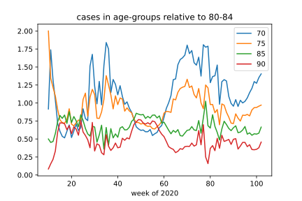

# COVID19_AgeStratifiedModel
age-stratified model incorporating testing and deaths to estimate a full picture

- Based on public data provied by the RKI through variouse sources
- Age-Stratified cases on Bundesland-level, mixing different age-strata, deaths, and testing available on a coarser level
- Tries to estimate IFR and per age hidden groups

## Features

### Agegroup 80+ extimation

